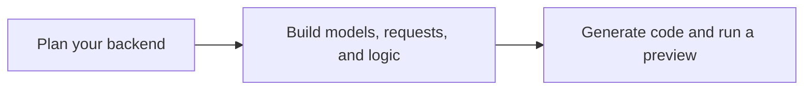

# Avora Overview

Avora is a visual backend development platform that helps you turn a product idea into a clear, working backend—without starting from a blank codebase.

Use this overview to understand what Avora is, what you can build, and how a backend moves from an idea to generated code.

## Start Here

If Avora is new to you, read this page first, then continue with the interface basics and quick start guide.

- [Before You Start](./before-you-start.md) — Learn the platform layout, canvas elements, and workspace model.
- [Quick Start](./quick-start.md) — Create a backend from a draft or build one manually from scratch.

## What Is Avora?

Avora gives you a visual way to plan, build, and launch the backend behind a digital product. You describe what you want to create, shape it in a shared workspace, and turn that design into backend code you can review and use.

It brings your data, application features, business rules, and backend workflows into one clear view. This makes the product easier to understand before development becomes complex and gives both technical and non-technical team members a common place to collaborate.

You can start with an idea, an AI draft, a template, or an existing design. Avora supports you throughout the journey while keeping you in control of the final result.

*Avora in 90 seconds: See how an idea becomes a visual backend workspace, generated code, and a running product with Avora.* [Watch video](https://www.dropbox.com/scl/fi/kiwtsb2vr8zocnr9vjqzm/avora-demo.mp4?rlkey=gi35imj8eszkhk58zm3jp8hm7&st=nv7ibo3v&raw=1)

## Why Avora?

Building a backend often requires time, specialist knowledge, and repeated setup before a product can be tested. Avora helps teams move from an idea to a usable foundation more quickly, with greater clarity at every stage.

With Avora, you can:

- **Move faster:** spend less time on repetitive setup and more time shaping the product.
- **Make ideas visible:** see how the backend is organized before committing to implementation.
- **Work better together:** give founders, product teams, and developers a shared understanding of what is being built.
- **Use fewer AI tokens:** update a selected node, request, or workspace area instead of repeatedly sending and regenerating the entire project.
- **Reduce security risks:** define authentication, roles, permissions, inputs, and validation visually so potential gaps are easier to identify before deployment.
- **Validate AI visually:** inspect every AI-generated change in the workspace, edit it directly, and validate it before generating code.
- **Keep full control:** customize the visual design and generated code, then export, extend, or deploy it without being locked into a fixed result.
- **Build for the future:** create a structured foundation that can grow with your product.

Avora combines the speed of AI-assisted creation with visual control. AI helps you build faster, while you remain responsible for reviewing, editing, and approving the result.

## What You Can Build

Avora creates complete, production-ready backends that you can launch, rely on, and evolve as your product grows.

- **Clear framework code:** Generate structured, maintainable backends with frameworks such as **NestJS** and **FastAPI**.
- **Production essentials:** Build your database, APIs, business logic, validation, error handling, authentication, roles, and permissions together.
- **Ready to launch:** Connect your database, review the generated code, and deploy the backend from the same workflow.
- **Fully extensible:** Customize every part and connect virtually any service through APIs, custom code, and reusable logic nodes.

From SaaS platforms and marketplaces to internal tools, customer portals, and mobile applications, Avora provides the complete backend foundation behind your product.

## How Avora Works

Move from an initial idea to a production backend through one clear, visual workflow. Review and refine the result at every stage.

Next, read [Before You Start](./before-you-start.md) to learn the interface and canvas vocabulary used throughout the documentation.
