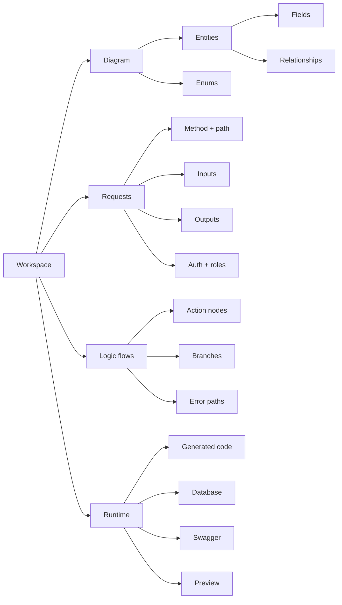

# Backend Schema

This schema shows the minimum structure Avora needs to generate a usable backend.

| Workspace contract | What it defines | Where to edit |
|---|---|---|
| Data model | Entities, fields, enums, keys, validation, and relationships | [Diagram Builder](./diagram-builder.md) |
| API contract | Methods, paths, headers, params, body inputs, outputs, and status codes | [Request Builder](./request-builder.md) |
| Behavior contract | Queries, conditions, loops, variables, integrations, outputs, and error handling | [Logic Flow Builder](./logic-flow-builder.md) |
| Runtime contract | Framework, database, environment variables, generated files, preview state, and Swagger | [Code Generation](./code-generation.md) |

If a generated result looks wrong, return to the contract that created it. Edit the visual workspace, then regenerate.
