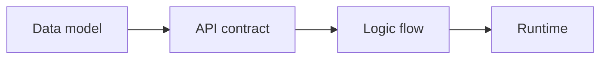

# Backend Fundamentals

Backend Fundamentals is the decision guide behind the Avora workflow. Use it when you need to choose the right entity shape, relationship type, request contract, auth rule, logic-flow path, or generated-backend review point.

> **Keep this tab focused.** Use these pages to make backend modeling decisions. Use the Platform docs for the exact click path inside Avora.

Start with these detailed docs when you need the full workflow:

- [Diagram Builder](./diagram-builder.md) — Create entities, enums, attributes, and relationships on the visual canvas.
- [Request Builder](./request-builder.md) — Define methods, paths, inputs, outputs, status codes, authentication, and roles.
- [Logic Flow Builder](./logic-flow-builder.md) — Connect the actions that run inside each request and route success or error outcomes.
- [Code Generation](./code-generation.md) — Generate, inspect, export, publish, or prepare the backend for preview.
