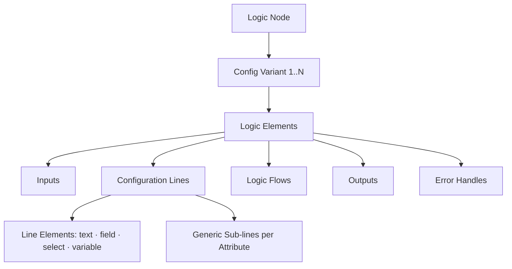

# Logic Node Builder — Complete Reference

Use this reference to define custom logic nodes that fit Avora's visual workflow system.

## 1. Introduction

Start here for the purpose of logic nodes and the builder model behind them.

### What Is a Logic Node?

A **Logic Node** is a configurable building block inside Avora's canvas-based backend workflow editor. Every API request in Avora runs through a **logic flow** — a graph of connected nodes, each performing a discrete operation: querying data, transforming a value, checking a condition, sending an HTTP request, etc.

The **Logic Node Builder** lets users and operators define custom nodes that don't yet exist in Avora's default library. It provides a highly structured environment where you model behavior using a consistent visual grammar, so custom nodes feel and behave identically to built-in ones.

> **Philosophy:** Freedom + consistency through structure. You define *what* your node does; the builder ensures it *looks and behaves* like everything else on the canvas.

If the provided structure cannot cover a specific use case, you can **send a request** to the Avora team for native support.

---

## 2. Core Concepts & Glossary

| Term | Definition |
|---|---|
| **Logic Node** | The top-level container. Has a name, category, description, color, and icon. |
| **Category** | Groups nodes functionally: Data, Control Flow, Integration, Transform, Auth, Other. |
| **Config Variant** | A distinct operating mode of a node (e.g., a Database node has SELECT, INSERT, UPDATE, DELETE variants). A node may have one or many. |
| **Logic Elements** | The building blocks inside a variant: inputs, configuration lines, logic flows, outputs, error handles. |
| **Input** | A typed variable fed into the node at runtime. Types: `string`, `number`, `boolean`, `object`, `datetime`, `any`, or a workspace enum name. |
| **Configuration Line** | A visual row of interactive elements the user fills in to configure the node's behavior. |
| **Line Element** | A single widget inside a config line: `text` (static label), `field` (typed input), `select` (dropdown), or `variable` (flow-connected value). |
| **Logic Flow** | A named execution path out of the node (e.g., `success`, `error`, `true branch`). |
| **Output** | A named, typed value returned by the node when it executes. |
| **Error Handle** | A defined failure condition with a status code, message, and a flag controlling whether execution stops or continues. |

---
