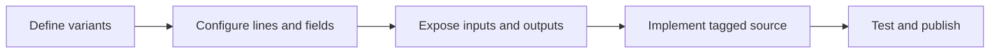
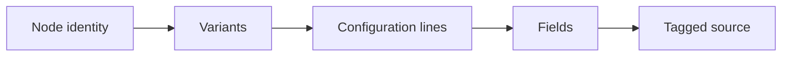
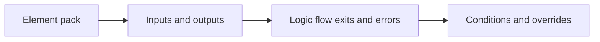
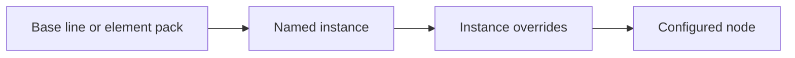
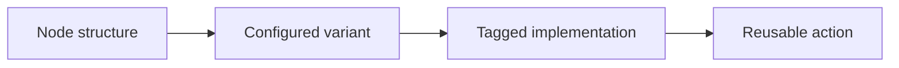

# Logic Node Overview

Logic nodes are designed to cover deeper backend functionality without losing visual consistency. They give every builder one shared process: structure the visual node, define the configurable choices, then code the matching template that turns those choices into real backend behavior.

Because logic nodes follow the same visual form and template-mapping process, users can exchange functionality more easily. A team member or community creator can build the node structure, implement its code template, publish the result, and let others clone, reuse, or adapt it through the same familiar configuration flow.

## Why Build Logic Nodes?

- **Turn complex code into a reusable visual action.** Build the functionality once, then use and adapt it across different projects.
- **Allow full customization through one consistent format.** Every node can support its own behavior and configuration while keeping the same familiar visual structure for users.
- **Reuse instead of rewriting.** Avora and node creators can provide ready-to-use nodes. Community members can publish and share nodes, while other users can clone and edit them for their own projects.

A logic node has two connected sides: the visual configuration users edit and the code template that runs behind it. Node building defines the reusable visual structure, while code building connects that structure to its implementation. The figure shows how a variant, its config lines, and their fields map to the matching regions of the code template.

The fields configured in the visual node are connected to matching tags in its code template. When a user selects or enters a field value, Avora uses that value to fill the corresponding part of the code.

This is like writing the code visually. You keep the freedom to create your own logic and customize how it works, while other users can configure it without learning different programming frameworks or writing long sections of code.

## Design a Logic Node

Start with one clear task. Add only the choices users need, then connect those choices to the implementation.

### Structure Levels

Follow the arrows from top to bottom. Each bold title is the level you are working with, and the numbered sentence explains the decision that produces the next level. The right side uses Query Database as an example to make each level of the process easier to understand.

**0. Choose the functionality.** Start with the job you want to reuse. For example, if different projects need to work with database data, do not design the node around one table or one request. Create a **Query Database** node that can work with whichever model the user selects.

In the Node Builder, this starts in [Identity and Appearance](./visual-node-builder.md#identity-and-appearance), where you name the reusable action, choose its category, and set its visual style.

**1. Find the main use cases.** Next, ask what someone may want to do with that node. With **Query Database**, they may add, get, update, or delete data. These actions share the same database purpose, so they become variants of one node instead of four separate nodes.

In the Node Builder, create these modes in [Variants](./visual-node-builder.md#variants), then select each variant to edit its own lines, elements, and conditions.

**2. Define the settings.** Now look at one variant more closely. When it comes to **Get Query**, the user needs to choose which model to query and the expected form of the result. They may also want to filter the records, sort them, include relations, or use pagination. Each of these groups becomes a config line, such as **Resource**, **Filtering**, **Order By**, or **Pagination**.

In the Node Builder, add these rows in [Configuration Lines](./visual-node-builder.md#configuration-lines). Each line controls its name, type, visibility, icon, repeat behavior, and field order.

**3. Expose the changing values.** Finally, decide what the user can change inside each config line. **Resource** needs **Model** and **Expected** fields. **Filtering** needs **Attribute**, **Condition**, and **Value**, while **Order By** needs an attribute and an order. These fields are the controls users fill visually, and their selected values are passed to the matching tags in the code template.

In the Node Builder, configure those controls in [Fields](./visual-node-builder.md#fields). Use [Text Label](./visual-node-builder.md#text-label), [Input Field](./visual-node-builder.md#input-field), and [Select Field](./visual-node-builder.md#select-field) depending on whether the row needs static text, typed input, or a choice list.

### Elements Pack

Every logic node structure is composed of two parts:

- **The configuration part** contains the variant and its children: config lines and the fields inside those lines.
- **The elements part** contains the node’s input, logic flow, output, and error elements.

This composition is intentional: it allows each configuration case to expose only the elements it needs. Because elements depend on the configuration, a specific configuration item may require an element that other items do not. The **variant**, each **config line**, and each **field** can therefore have their own elements.

In the Node Builder, create and adjust these canvas-facing parts in [Element Packs](./visual-node-builder.md#element-packs). Start with [Base Elements](./visual-node-builder.md#pack-settings), then configure the needed [Inputs](./visual-node-builder.md#inputs), [Outputs](./visual-node-builder.md#outputs), [Logic Flows](./visual-node-builder.md#logic-flows), and [Error Handlers](./visual-node-builder.md#error-handlers).

The schema below shows how each level of the configuration affects the elements exposed by the node.

**How to read the figure:**

- **Element pack:** the blue containers are the elements that form the node’s element pack: Input, Logic flow, Output, and Error.
- **Order:** Element input appears before the configuration, while Logic flow, Output, and Error appear after it. This keeps the custom node consistent with request nodes and makes the two sides easier to distinguish in the Logic Flow workspace.
- **Data flow:** inputs feed the configuration, then the configuration gives back the remaining elements.
- **Example:** in the filtering config line, the `value` tag shows an input value being used inside a configuration field.

### Custom Behavior

Before defining custom behavior, it helps to understand an **instance**. An instance is a sub-version of a config line or element pack. It reuses the original part, so you can change only what is different without creating the same structure again from scratch.

In the Node Builder, create these alternatives in [Instances](./visual-node-builder.md#instances). Use a line instance for an alternate row configuration, or an element-pack instance for alternate inputs, outputs, logic flows, and errors.

In the previous schema, the **Expected** condition creates a new **Element Pack A**. You can instead create an instance of the **Base Elements** for that condition and modify only the elements it needs. The same approach works for config lines and their instances.

Both methods work: you can create a separate part from scratch or create an instance of an existing one. Choose the structure that is clearest for you while building the node and for anyone who will configure it later.

> **When should I override from scratch, and when should I use an instance?.** Create the override from scratch when the new structure is substantially different from the original and reusing it would make the node harder to understand. Use an instance when most of the config line or element pack stays the same and only a few details change. As a best practice, reuse an instance to avoid duplication, but choose a separate override whenever it makes the node clearer for builders and users.

Now, let’s see how these element-pack changes are linked to the configuration and applied through custom behavior.

Look again at the Element Pack figure. Every configuration change that affects the node’s elements depends on two crucial parts, highlighted in bold in the middle of that figure:

- **Condition** — watches the configuration, such as the active variant, whether a config line is shown, or whether a field is equal to a specific value. Build this in [Conditions](./visual-node-builder.md#conditions).
- **Target action** — defines which part should change and how its elements should be included, such as a full override, an append, or an instance. Build this in [Behaviors](./visual-node-builder.md#behaviors).

Together, these two parts define **when** and **how** elements are added. Custom behavior connects them so you can place the right elements under the right condition and customize how the visual structure of the logic node responds.

## Logic Node Summary

A logic node turns one functionality into a reusable visual action. The main ideas to remember are:

- **Build the structure:** divide the functionality into variants, config lines, and fields.
- **Connect configuration and elements:** configuration holds the user’s choices, while element packs provide the input, logic flow, output, and error elements.
- **Adapt each case:** the active configuration can keep the Base Elements, append new elements, or override them.
- **Reuse with instances:** an instance is a sub-version of a config line or element pack that avoids rebuilding the same part from scratch.
- **Control behavior and code:** conditions and target actions determine when and how the visual structure changes, while configured field values fill the matching tags in the code template.

To learn more about each process and how to apply it, continue with the guides below:

- [Visual Node Builder](./visual-node-builder.md) — Create the visual action and the choices users can configure.
- [Code Builder](./code-builder.md) — Connect the visual values to the node implementation.
- [Publish, Share, and Clone](./share-logic-nodes.md) — Reuse a ready-made node or share one with the community.
