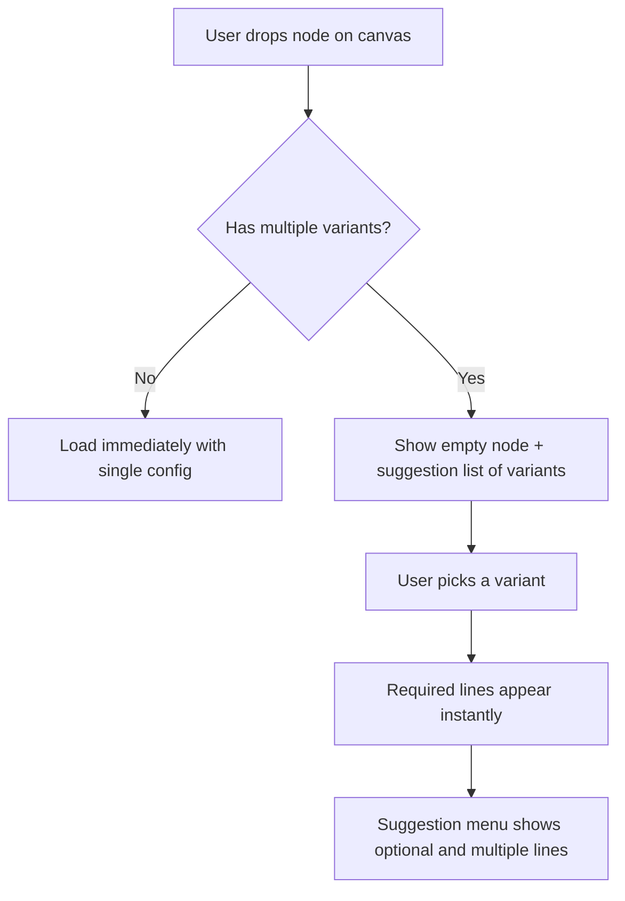

## 3. How Config Variants Work

Config variants define the different operating modes a node can expose on the canvas.

### Single vs. Multiple Variants

- **One variant** → the node loads immediately with that variant's configuration pre-applied. No selection step needed.
- **Multiple variants** → the node opens **empty**. A suggestion list displays all available variant titles. The user selects one; required lines appear immediately. Optional and additional lines are then accessible from the suggestion menu.

> **Example:** A Database node with SELECT / INSERT / UPDATE / DELETE starts empty. Picking INSERT collapses the variant list and shows INSERT's required lines, while SELECT's optional WHERE / ORDER BY / LIMIT lines appear in the suggestion menu.

---

## 4. Configuration Lines

Configuration lines describe the editable sentence-like controls inside each node variant.

### 4.1 Line Types

Every line has a `lineType` that controls how many times it can appear, whether it is deletable, and how it behaves in the suggestion menu.

| Type | Visible by Default | Max Instances | Deletable | Suggestion Menu |
|---|---|---|---|---|
| **required** | Yes, immediately after variant select | 1 | No | Does not appear (already shown). If programmatically removed, all elements bound to it are also removed. |
| **optional** | No | 1 | Yes | Appears when not present; disappears once added. Re-appears if the user deletes the line. |
| **multiple** | No | Unlimited | Yes | Always present in the suggestion menu, regardless of how many instances already exist. |
| **generic** | No | 1 set per class | No | Appears as a class selector; expands into one sub-line per attribute once a class is chosen. |

### 4.2 Line Elements

Each line is composed of one or more **line elements** laid out horizontally to form a readable "sentence".

| Element Kind | Purpose | Auto-adapts Widget? |
|---|---|---|
| `text` | Static display label (e.g., "FROM", "WHERE", "To"). Not interactive. | — |
| `field` | Typed input. Widget adapts to `fieldType`: `number` → spinner/counter, `boolean` → toggle switch, `datetime` → date picker, `string`/`text` → text input. | ✅ |
| `select` | Dropdown choice list. Options can be static, from workspace enums, or workspace objects. | — |
| `variable` | A tag-style input accepting either a typed literal value OR a connected variable from the flow graph. | — |

---
